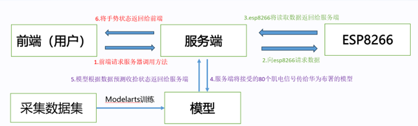
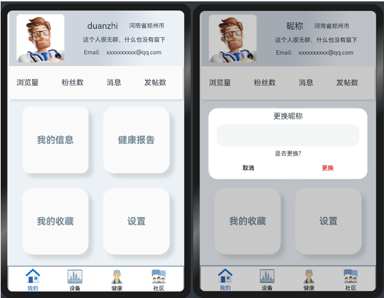
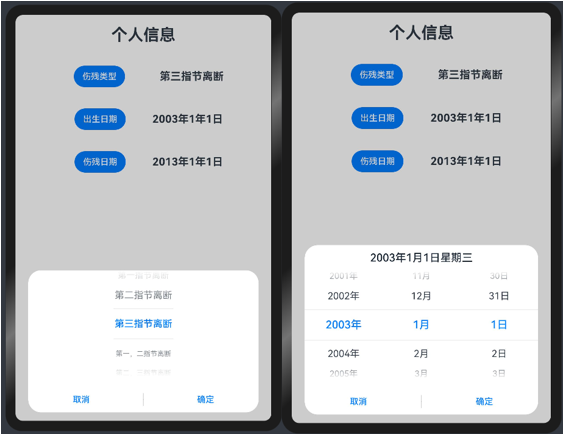
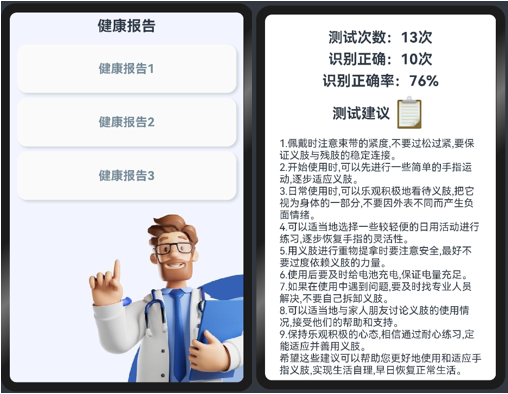
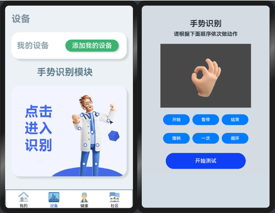
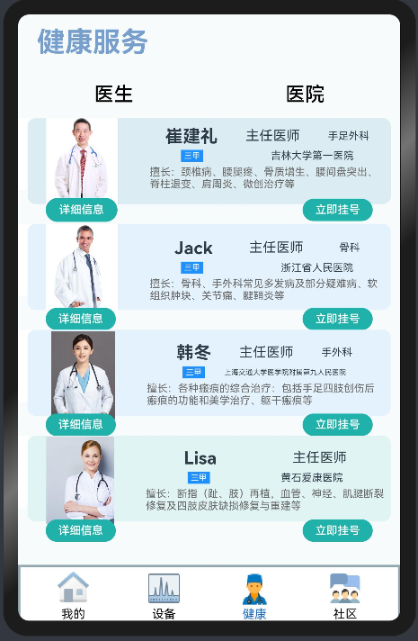

# 基于OpenHarmony的主被动式断指辅具

# <a name="_toc150461007"></a>摘  要

我国的断指患者人数众多，断指给患者的生活带来了诸多不便。然而，市场上大多数产品透气性差，型号固定不能完全契合患者本身残指，多次更换义肢导致患者的义肢成本提高。并且现有的辅具并无康复功能，甚至患者在购买后无法进行熟练使用造成了残肢磨损，形成二次伤害，需要长期结合才可以达到正常使用，对于患者十分不便。

于是我们便提出基于OpenHarmony的主被动式断指辅具及其康复评估系统，为患者提供辅具和康复训练双定制化服务。我们的解决方案是，首先依托于三维扫描得到扫描文件，之后进行模型的修复和设计优化方案，同时我们还要进行运动和力学仿真，最后通过3D打印得到患者的定制化义肢。在这个过程中，我们结合了软件算法和人工智能的强大功能，以实现更精确的模型修复和优化，以及更有效的运动和力学仿真。

然后，我们利用基于鸿蒙系统的康复软件，为患者提供定制化的康复训练。这款软件不仅可以针对性地指导患者进行康复训练，还能实时评估患者的康复效果，为他们提供个性化的康复方案。通过软件的使用，患者可以在无医生的指导下进行系统的康复训练，从而提高效率。

此外，我们的系统还设置了交流平台，患者可以随时与其他患者或专业医生进行在线交流，分享康复经验和心得。通过这个平台，患者可以得到更多的支持和帮助，从而更好地应对康复过程中的各种挑战。

这样的个性化的辅具定制与康复软件的定制形成闭环康复流程，不仅缩短了患者的等待周期、降低产品费用、使产品的精细化和契合度更高，还使枯燥的康复过程娱乐化，更加全面地指出患者的康复状况，让患者通过软件测试和交流的过程中就可以完成绝大多数的康复锻炼。


# <a name="_toc150461009"></a>**1 软件分类**
该软件是专门为断指患者设计的，帮助他们进行康复训练和评估的工具。它基于鸿蒙系统开发，利用了计算机技术和人工智能算法，让康复训练变得更加智能化和个性化。

首先，软件可以根据患者的具体情况和医生的要求，制定个性化的康复方案。这些方案不是一成不变的，而是会根据患者的恢复情况和康复目标进行动态调整。通过与交互式游戏或虚拟现实场景的结合，康复训练变得像玩游戏一样有趣，让患者更容易坚持下去。

其次，软件还可以实时评估患者的康复效果。通过收集和分析患者的运动数据和生理指标，软件可以生成个性化的康复报告，让患者和医生清楚地了解患者的康复状况。这些数据也可以让医生及时发现患者的问题，并调整康复方案，让患者更快地恢复。

最后，软件还提供了一个在线交流平台，让患者之间或患者与医生之间可以随时进行交流。在这个平台上，患者可以分享自己的康复经验，得到其他人的鼓励和支持。同时，医生也可以通过这个平台为患者提供远程指导和建议，让患者在家里也能得到专业的康复帮助。

综上所述，这款基于OpenHarmony开发的的康复软件，通过个性化康复方案、实时评估和在线交流等功能，为断指患者提供了更为全面、专业的康复服务。通过使用这款软件，我们可以帮助断指患者提高康复效果、缩短康复周期，并帮助他们更好地恢复生活质量。
# <a name="_toc150461010"></a>**2 应用领域**
在国内，由于各种职业的特殊性，每年因意外事故造成的断指患者人数高达360万左右，但是由于不能及时就医或者断指保管不当，使得再植成功的人数比例仅占40%。根据国际手外科学会标准指出，拇指关节缺失导致功能丧失36%，食指、中指各占20%，无名指、小指各占9%。因此对于断指患者来说，装配一个可以控制活动的手指辅具对生活有极大帮助。

在医疗领域，断指辅具被广泛应用于帮助因各种原因导致手指缺失或损伤的患者。这些辅具旨在帮助患者恢复手指功能，提高生活质量。

相对应，我们的应用不仅提供了断指辅具的配套使用，还为患者提供了全面的检测、交流和询问等服务，旨在提高患者的使用体验和便利性。

通过专门的检测功能，我们的应用能够实时监测患者的断指恢复情况，并为其提供科学准确的检测结果，帮助患者更好地了解自身的恢复情况。

此外，我们的应用还设置了专门的交流平台，让患者可以随时与其他病友或专业医生进行在线交流，分享彼此的经验和心得，从而获得更多的支持和帮助。同时还提供了一对一的询问服务，患者可以随时就使用过程中遇到的问题或疑虑进行咨询，获得及时的解答和指导，从而更好地应对康复过程中的各种挑战。

通过这些全面的配套服务，我们的应用不仅为患者提供了更加便捷的断指辅具使用体验，还能够帮助他们更好地应对康复过程中的各种问题，重拾信心与勇气，迎接美好的未来。断指辅具通常由专业的医疗技术人员根据患者的具体需求和手指的实际情况定制。它们可以模拟真实手指的形状和功能，帮助患者完成日常生活中的各种任务。


# <a name="_toc150461011"></a>**3 作品概述**
## <a name="_toc150461012"></a>**3.1 软件背景及应用领域**
手指是我们日常活动中必不可少的器官，但手指受伤或缺失却是一个普遍存在的问题，目前全国手指残缺的人数每年都有360万左右。而在现有的断指辅具中，存在着很多不足之处。

OpenHarmony作为一种开源的操作系统，为断指辅具的开发提供了统一的软件平台。通过OpenHarmony，开发者可以更加方便地为患者定制各种形状和功能的假肢，以满足患者的不同需求。

随着医疗技术的不断发展，对断指辅具的要求也越来越高。不仅要求假肢能够模拟真实手指的形状和功能，还要求能够实现更加自然、舒适的使用体验。而OpenHarmony作为一种新型的操作系统，具有分布式、跨平台等特点，可以满足行业发展的需求，为断指辅具的开发提供更广阔的空间。

通过OpenHarmony的分布式特点，可以将传感器与假肢相结合，实现智能感知和响应。这种智能感知技术可以为患者提供更加自然、舒适的使用体验，同时也可以提高假肢的效能和性能。例如，通过传感器可以感知手指的移动和受力情况，并将这些信息传递给假肢控制系统，从而实现更加精准的控制和响应。

该项目运用3维扫描患者手部来进行一对一设计，采用衍生式设计的方法，通过多次迭代，不断优化设计方案，我们利用华为云平台来进行EMG手势识别算法的搭建，借助吗ModelArts使过程变得简单高效，同时算法得到优化，准确的识别多种手势，实现主动控制。在基于OpenHarmony开发的应用端上实时观测到手势的识别结果，同时，OpenHarmony的开源特性也为开发者提供了更多的自由和创新空间，推动了断指辅具技术的不断发展和进步。小游戏来辅助患者更好的使用。总之，我们将不断探索和改进，让这款主被动式断指辅具更加贴近人们的生活，为用户带来更大的便利和舒适。
## <a name="_toc150461013"></a>**3.2 作品特点和设计思路**
### <a name="_toc150461014"></a>**3.2.1 项目主要创新点**
（1）个性化康复辅具设计：通过三维扫描和修复技术，项目团队能够获取患者的真实残指模型，并进行个性化的三维修复建模。这使得康复辅具可以根据每位患者的具体情况进行定制，以确保最佳的适配性和效果。

（2）3D打印技术的应用：项目充分利用了3D打印技术，将辅具的骨骼框架和外敷皮肤以高精度制造。这不仅提高了生产效率，还确保了产品的轻量化设计和美观度，远超传统义肢。

（3）康复训练和评估系统：项目引入了基于鸿蒙交互式系统的康复训练，为患者提供定制化的康复训练，可以在多个场景进行。此外，康复评估系统会根据患者的训练动作和训练次数等数据提供更好的康复训练建议，有助于患者更快地康复。

（4）闭环康复系统：项目提供了一种闭环康复解决方案，将康复辅具的设计和制造与康复训练、评估和建议相结合。这种综合性的康复系统可以更全面地满足断指患者的康复需求，从而提高了康复效果。

（4）轻质化和力学优化设计：项目采用了衍生式设计，对辅具的结构进行了轻质化和力学优化，以提高产品的刚性和轻量性。这不仅提高了患者的舒适度，还有助于更好地支撑抓握动作。

该项目的创新点在于综合运用现代技术（如3D打印、鸿蒙交互式系统等）解决了断指患者康复过程中的多个问题，包括康复辅具的个性化、轻质化设计、康复训练和评估，以及闭环康复系统的建立。这些创新点将有望提高断指患者的康复体验和康复效果，改善他们的生活质量。
### <a name="_toc26372"></a><a name="_toc150461015"></a>**3.2.2 作品设计思路**
在前端，用户通过浏览器或其他客户端向服务器发起请求，调用特定的方法。

服务器接收到请求后，会向ESP8266设备发送指令，请求获取数据。ESP8266设备读取相关数据，并将这些数据返回给服务器。服务器将接收到的80个肌电信号传递给已经部署在华为云上的模型。模型根据接收到的数据预测收拾状态，并将预测结果返回给服务器。服务器将手劳状态返回给前端，用户可以在浏览器或客户端上看到这些信息。

项目架构图：



**图3-1 项目设计架构**
## <a name="_toc150461016"></a>**3.3 功能描述**
我们基于OpenHarmony开发一个专门的应用端来帮助断指患者更好地管理康复过程。旨在为断指患者提供全面的康复辅助和健康管理。

主要功能：

康复计划管理：应用端允许用户创建个性化的康复计划，根据医生的建议和康复进度进行调整。用户可以轻松追踪自己的康复目标，记录进展并设置提醒。

健康数据监测：应用允许用户记录和监测伤口愈合进度、疼痛感觉和肢体功能恢复情况。这些数据将被可视化呈现，以便用户和医生更好地了解康复情况。

社交支持和资源分享：断指康复助手还建立了一个社区，患者可以在这里分享经验、交流心得，并获得他人的支持和鼓励。应用还提供有关康复资源和医疗专家的信息。

数据安全和隐私：应用将用户的健康数据存储在安全的云端服务器上，确保数据的隐私和保密性。用户完全掌握自己的数据，并可以选择与医生共享以获得更好的医疗建议。
## <a name="_toc150461017"></a>**3.4 体系结构和关键技术点**
### <a name="_toc150461018"></a>**3.4.1 登录**
首先我们通过网络管理中的数据请求来实现登录

Login函数：这是一个用于处理登录逻辑的函数。在该函数中，使用了小程序的HTTP模块来发起HTTP请求。

httpRequest对象：通过http.createHttp创建了一个HTTP请求对象。

定义了登录接口的url：登录请求将被发送到IP地址和端口号。

httpRequest.request方法：通过该方法发起HTTP请求，使用了POST方法，设置了请求头的Content-Type为application/json。

extraData中包含了登录所需的用户名和密码，这两个值可能是从用户输入框中获取的。

connectTimeout和readTimeout：设置了连接和读取的超时时间。

```java
Login() {
  let httpRequest = http.createHttp();
 
  let url = "http://127.0.0.1:8000/login/"
  httpRequest.request(
    url,
    {
      method: http.RequestMethod.POST,
      header: {
        'Content-Type': 'application/json'
      },
      extraData: {
       
        "username": this.username,
        "password": this.password
      },
      connectTimeout: 6000,
      readTimeout: 6000,
    }, (err, data) => {
    if (!err) {
      if (data.responseCode == 200) {
        console.info("传递成功")
        console.info("从服务器返回接口返回数据成功，传递参数" + data.result)
      }
      console.info('Result:' + data.result);
      console.info('code:' + data.responseCode);
      console.info('header:' + JSON.stringify(data.header));
      console.info('cookies:' + data.cookies);
     
      if(data.result == '登录成功') {
        router.push({
          url:"pages/fuwu"
        })
      }
      else if (data.result == '账户或密码错误'){
        prompt.showToast({
          message:"账户密码错误",
          duration:2000,

        });
      }
    } else {

      console.info('error:' + JSON.stringify(err));

      httpRequest.destroy();
    }
  }
  );
}
```
### <a name="_toc150461019"></a>**3.4.2 修改昵称**
在前端应用中创建一个弹窗元素，包括一个文本输入框、一段文字、以及两个按钮，用于实现修改昵称的功能。

```java
Text('更换昵称').fontSize(20).margin({ top: 10, bottom: 10 })
TextInput({ placeholder: '', text: this.textValue }).height(60).width('90%')
  .onChange((value: string) => {
    this.textValue = value
  })
Text('是否更换?').fontSize(16).margin({ top:10, bottom: 10 })
Flex({ justifyContent: FlexAlign.SpaceAround }) {
  Button('取消')
    .onClick(() => {
      this.controller.close()
      this.cancel()
    }).backgroundColor(0xffffff).fontColor(Color.Black)
  Button('更换')
    .onClick(() => {
      this.inputValue = this.textValue//替换
      this.controller.close()
      this.confirm()
    }).backgroundColor(0xffffff).fontColor(Color.Red)
}.margin({ bottom: 10 })
```
然后设置修改，这段代码片段整体上是在组件中声明了一些状态和回调函数，然后使用这些状态和回调函数创建了一个自定义对话框控制器，以实现对话框的定制和交互。

```java
@State textValue: string = ''
@State inputValue: string = '昵称'
dialogController: CustomDialogController = new CustomDialogController({
  builder: CustomDialogExample({
    cancel: this.onCancel,
    confirm: this.onAccept,
    textValue: $textValue,
    inputValue: $inputValue
  }),
  cancel: this.existApp,
  autoCancel: true,
  alignment: DialogAlignment.Default,
  offset: { dx: 0, dy: -20 },
  gridCount: 4,
  customStyle: false
})

aboutToDisappear() {
  delete this.dialogController,
  this.dialogController = undefined
}

onCancel() {
  console.info('Callback when the first button is clicked')
}

onAccept() {
  console.info('Callback when the second button is clicked')
}

existApp() {
  console.info('Click the callback in the blank area')
}
```

### <a name="_toc150461020"></a>**3.4.3 信息选择**
创建一个按钮，当点击按钮时，弹出一个文本选择对话框，用户可以从中选择伤残类型。选择的结果会通过回调函数进行处理。
```java
Button("伤残类型")
  .margin(20)
  .onClick(() => {
    TextPickerDialog.show({
      range: this.shangcanage,
      
      onAccept: (value: TextPickerResult) => {
      
        this.select1 = value.index
        console.info("TextPickerDialog:onAccept()" + JSON.stringify(value))
      },
      onCancel: () => {
        console.info("TextPickerDialog:onCancel()")
      },
      onChange: (value: TextPickerResult) => {
        console.info("TextPickerDialog:onChange()" + JSON.stringify(value))
      }
    })
  })
```

### <a name="_toc150461021"></a>**3.4.4 康复评估**
设置数据传输，用来训练数据得到结果。

创建一个 HTTP 请求对象，定义了请求的 URL，使用 request 方法发起 HTTP 请求，指定了请求方法为POST，设置请求头为JSON 格式。

在请求的extraData 中包含了一些参数，需要根据实际情况传递有效的数据。在请求回调函数中，处理请求成功和失败的情况。如果返回的结果是 '测试成功'，则显示提示信息；否则，显示账户密码错误的提示信息。最后，根据请求的结果进行相应的处理，包括日志输出和提示信息。

```
S_login() {
  let httpRequest = http.createHttp();

  let url = "https://aip.baidubce.com/rpc/2.0/ai_custom_bml/v1/table_infer/emg_finger?access_token=24.a96f9a18bc0298ca1f07dbd8b5b63945.2592000.1694417034.282335-37576462"
  httpRequest.request(
    url,
    {
      method: http.RequestMethod.POST,
      header: {
        'Content-Type': 'application/json'

      },
      extraData: {
        "include_req":false,
        "data":[{
          "col0":0.046904,
          "col1":0.03827,
          "col2":0.027714,
          "col3":0.027727,
            ...
          "col78":1,
          "col79":1
        }
        ]
      },
      connectTimeout: 6000,
      readTimeout: 6000,
    }, (err, data) => {
    if (!err) {
      if (data.responseCode == 200) {
        console.info("传递成功")
        console.info("从服务器返回接口返回数据成功，传递参数" + data.result)
      }
      //console.info('Result:' + data.result['username']);
      console.info('Result:' + data.result);
      console.info('code:' + data.responseCode);
      console.info('header:' + JSON.stringify(data.header));
      console.info('cookies:' + data.cookies);
  
      if(data.result == '测试成功') {
        console.info('okok');
        Prompt.showToast({
          message:"测试成功",
          duration:2000,

        });

      }
    } else {
      console.info('error:' + JSON.stringify(err));

      httpRequest.destroy();

      Prompt.showToast({
        message:"错误",
        duration:2000,

      });

    }
  }
  );
}
```

手势识别界面，包括显示手势识别标题、提示信息，以及一个包含图像动画和控制按钮的界面。用户可以通过按钮控制动画的播放、暂停、结束，并设置撤销、播放次数等参数。图像动画通过ImageAnimator组件实现，根据按钮的点击事件改变动画状态和参数。

```java
Text("手势识别")
  .fontWeight(FontWeight.Bold)
  .fontSize(30)
Text("请根据下面顺序依次做动作")
  .fontWeight(FontWeight.Bold)
  .fontSize(20)
Column({ space: 20 }) {
  ImageAnimator()
    .images([
      {
        src: $r('app.media.shoushi7')
      },
      {
        src: $r('app.media.shoushi6')
      }

    ])
    .duration(13000)
    .state(this.state).reverse(this.reverse)
    .fillMode(FillMode.None).iterations(this.iterations).width(340).height(240)
    .margin({ top: 15 })
    .onStart(() => {
      console.info('start')
    })
    .onPause(() => {
      console.info('Pause')
    })
    .onRepeat(() => {
      console.info('Repeat')
    })
    .onCancel(() => {
      console.info('Cancel')
    })
    .onFinish(() => {
      console.info('Finish')
      this.state = AnimationStatus.Stopped
    })
  Row() {
    Button('开始').width(100).padding(5).onClick(() => {
      this.state = AnimationStatus.Running
    }).margin(5)
    Button('暂停').width(100).padding(5).onClick(() => {
      this.state = AnimationStatus.Paused  
    }).margin(5)
    Button('结束').width(100).padding(5).onClick(() => {
      this.state = AnimationStatus.Stopped  
    }).margin(5)
  }

Button('开始测试')
  .width(300)
  .height(60)
  .margin(20)
  .fontSize(20)
  .backgroundColor('#0F40F5')
  .onClick(() => {
    this.S_login();
  })
```
## <a name="_toc150461022"></a>**3.5 功能模块设计**
### <a name="_toc150461023"></a>**3.5.1 我的页面**
在此页面里可修改昵称，查看我的信息，健康报告，我的收藏和设置。



**图3-2 我的页面**

我的信息里可修改伤残类型和伤残日期。



**图3-3 修改信息**

健康报告里可查看生成的健康报告。



**图3-4 健康报告**
### <a name="_toc150461024"></a>**3.5.2 康复评估**
健康数据监测，展示手势每隔4s做一个动作，患者依据展示图片完成相应手势来进行检测。



**图3-5 康复评估**
### <a name="_toc150461025"></a>**3.5.3 健康服务**
患者查看医生信息进行挂号。



**图3-6 健康服务**
### <a name="_toc150461026"></a>**3.5.4 社交支持和资源分享**
患者可以进行社区发帖来进行讨论交流。
## <a name="_toc150461027"></a>**3.6 验收标准**
功能性：主被动式断指辅具应具备模拟真实手指的功能，包括主动式手指和被动式手指的特性。主动式手指应能够根据患者的意愿和需求进行动作，如弯曲、伸直、抓握等，而被动式手指则应能够在没有患者主动操作的情况下，根据环境因素（如温度、压力等）做出响应。

稳定性：主被动式断指辅具应具备良好的稳定性，确保在各种情况下都能够稳定地工作，避免出现故障或失灵的情况。

舒适性：主被动式断指辅具应具有良好的舒适性，确保患者在使用过程中不会感到疼痛、不适或疲劳。同时，外观设计应美观、符合人体工程学原理，易于清洁和维护。

安全性：主被动式断指辅具应符合相关的安全标准，如防火、防电击、防机械损伤等，确保患者在使用过程中的安全。

兼容性：主被动式断指辅具应能够与OpenHarmony操作系统良好地兼容，实现信息的传输和控制。同时应具备良好的可扩展性和可升级性，以便在未来进行功能扩展和升级。

创新性：主被动式断指辅具应具备创新性，能够充分体现参赛者的创意和独特性。创新的设计和功能可以为主被动式断指辅具带来更多的应用前景和市场潜力。
